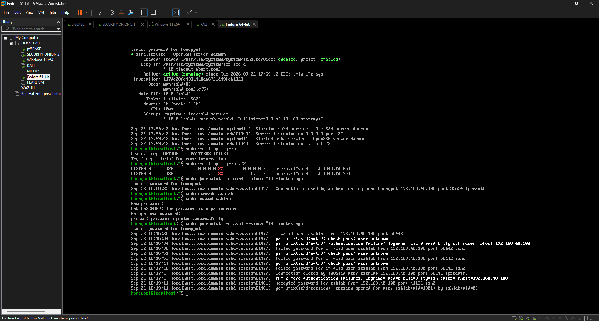
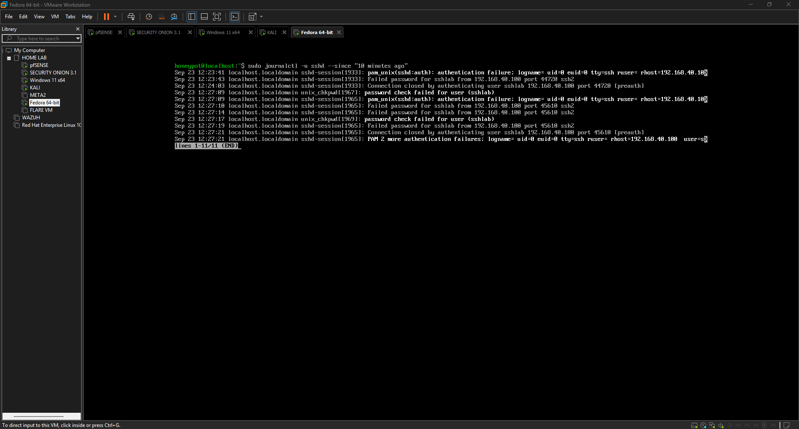
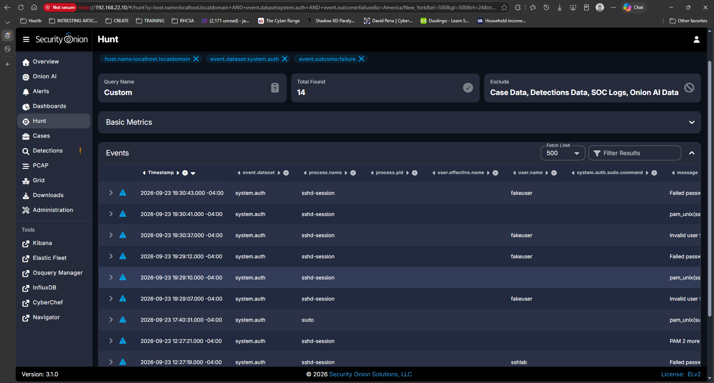
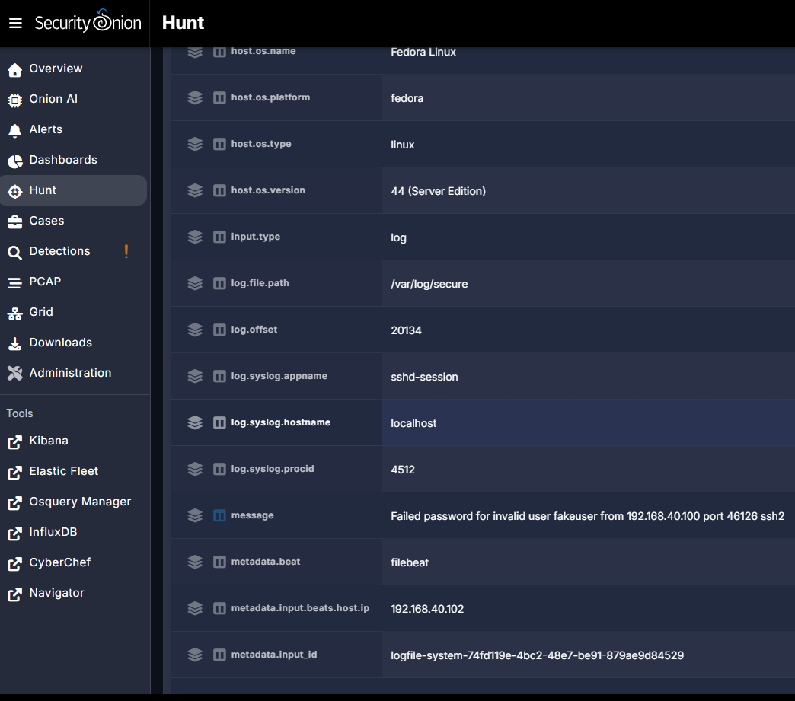
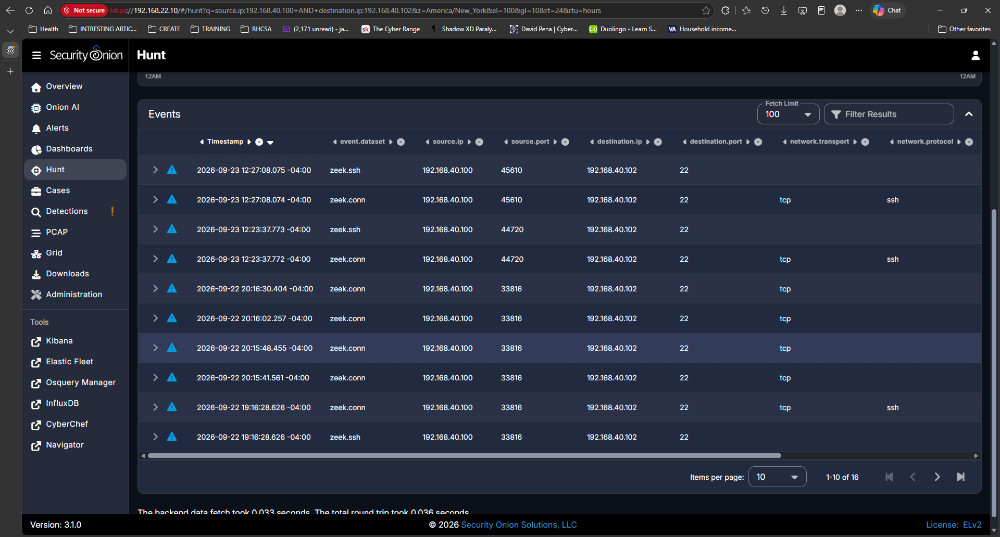
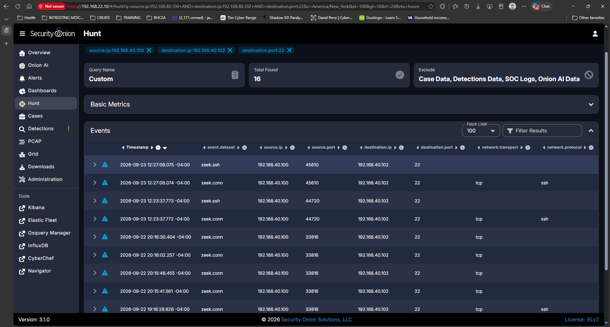
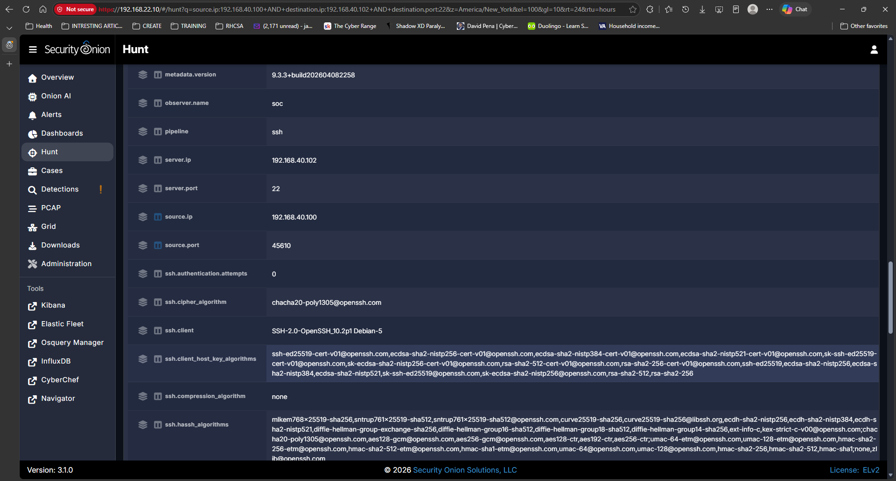

# Investigation 02: Failed SSH Authentication Against Fedora Linux

## Executive Summary

This investigation documents repeated failed SSH authentication attempts against a Fedora Linux server in an isolated SOC home lab. Kali Linux (`192.168.40.100`) was used to generate controlled SSH authentication failures against the Fedora server (`192.168.40.102`) on TCP port 22.

The activity was investigated using both host-based and network-based telemetry. Fedora authentication logs recorded the failed login attempts, while Security Onion ingested the host logs and provided centralized analysis through Hunt. Zeek network telemetry independently confirmed SSH communication between the Kali source and Fedora destination.

The investigation demonstrates the ability to correlate endpoint authentication logs with network telemetry to identify the source, destination, service, and outcome of suspicious authentication activity.

---

## Lab Environment

| System | Role | IP Address |
|---|---|---|
| Kali Linux | Testing / Source Host | `192.168.40.100` |
| Fedora Linux | Monitored Linux Server | `192.168.40.102` |
| Security Onion | SIEM / Network Monitoring | `192.168.22.10` |
| pfSense | Firewall / Routing | `192.168.40.254` |

The activity was performed in an isolated VMware Workstation home-lab environment for authorized security testing.

---

## Investigation Objective

The objective was to determine whether repeated SSH authentication failures against the Fedora server could be identified and correlated across multiple telemetry sources.

The investigation focused on answering:

- What system initiated the SSH connections?
- What system received the connections?
- Which service and port were targeted?
- Were the authentication attempts successful or unsuccessful?
- Did Fedora record the authentication failures?
- Did Security Onion receive the Fedora authentication logs?
- Could network telemetry independently confirm the SSH communication?

---

## 1. Fedora SSH Authentication Logging

The Fedora server was first examined directly to verify that the SSH service was running and that authentication activity was being recorded locally.

The `journalctl` command was used to review SSH authentication events.

```bash
sudo journalctl -u sshd --since "10 minutes ago"
```

The logs showed SSH authentication activity originating from `192.168.40.100`.



This established Fedora as the host generating the authentication evidence used later in the investigation.

---

## 2. Repeated Failed SSH Authentication

Additional Fedora logs showed multiple authentication failures associated with SSH connections from `192.168.40.100`.



The repeated events demonstrated that the activity was not limited to a single failed login attempt.

---

## 3. Security Onion Authentication Hunt

Security Onion Hunt was used to search the Fedora authentication telemetry.

The investigation filtered for:

```text
host.name:localhost.localdomain
event.dataset:system.auth
event.outcome:failure
```

The query returned multiple failed authentication events.



This confirmed that Fedora authentication telemetry was successfully available for centralized analysis in Security Onion.

---

## 4. Failed SSH Event Analysis

A failed authentication event was expanded for detailed analysis.

The event identified:

- Operating system: Fedora Linux
- Host IP: `192.168.40.102`
- Log source: `/var/log/secure`
- Process: `sshd-session`
- Source IP: `192.168.40.100`
- Authentication method: password
- Authentication result: failure
- Username: `fakeuser`

The event message recorded:

```text
Failed password for invalid user fakeuser from 192.168.40.100 port 46126 ssh2
```



This provided host-level evidence connecting the failed authentication attempt to the Kali source address.

---

## 5. Network Traffic Correlation

The investigation then moved from host telemetry to network telemetry.

Security Onion Hunt was used to identify traffic between:

```text
Source:      192.168.40.100
Destination: 192.168.40.102
Port:        22
Protocol:    SSH
```

Zeek generated both `zeek.conn` and `zeek.ssh` events for communication between the two systems.



This independently confirmed network communication between Kali and Fedora.

---

## 6. SSH Port 22 Analysis

The Hunt query was further restricted to TCP port 22:

```text
source.ip:192.168.40.100
destination.ip:192.168.40.102
destination.port:22
```

Security Onion returned multiple matching network events.



This established that the observed network activity was directed at Fedora's SSH service.

---

## 7. Zeek SSH Session Analysis

A Zeek SSH event was expanded to examine session metadata.

The event identified:

```text
Source IP:       192.168.40.100
Destination IP:  192.168.40.102
Destination Port: 22
Protocol:        SSH
```

Zeek also recorded SSH client and cryptographic negotiation metadata.



Zeek therefore provided an independent network-level data source that could be correlated with the Fedora authentication logs.

---

## Evidence Correlation

The investigation produced two complementary sources of evidence.

**Host telemetry**

Fedora authentication logs showed failed SSH password attempts originating from `192.168.40.100`.

**Network telemetry**

Zeek observed SSH connections from `192.168.40.100` to `192.168.40.102` on TCP port 22.

Together, these data sources establish the following activity chain:

```text
Kali Linux
192.168.40.100
      |
      | SSH / TCP 22
      v
Fedora Linux
192.168.40.102
      |
      | Authentication logs
      v
Elastic Agent / System Integration
      |
      v
Security Onion
      |
      +---- Host authentication analysis
      |
      +---- Zeek network correlation
```

---

## MITRE ATT&CK Mapping

The simulated activity is consistent with authentication attempts against a remote service.

**Tactic:** Credential Access

**Technique:** T1110 - Brute Force

The lab generated repeated password authentication failures to demonstrate how authentication-related activity can be identified and investigated.

Because this was controlled activity inside the home lab, the observed events do not represent an actual compromise.

---

## Analyst Assessment

The investigation confirmed repeated failed SSH authentication attempts originating from Kali Linux (`192.168.40.100`) and targeting the Fedora Linux server (`192.168.40.102`) over TCP port 22.

Fedora host telemetry recorded the failed password attempts, including attempts involving an invalid username. Security Onion successfully ingested this authentication telemetry and exposed the events through Hunt. Zeek independently recorded the associated SSH network sessions between the same source and destination systems.

The host and network evidence are consistent with the controlled SSH authentication activity performed during the lab. No evidence collected during this investigation demonstrates that the failed attempts resulted in unauthorized access or system compromise.

---

## Skills Demonstrated

- Linux authentication log analysis
- SSH investigation
- Security Onion Hunt
- Elastic Agent telemetry collection
- SIEM event filtering
- Zeek network analysis
- Host and network telemetry correlation
- Source and destination analysis
- Authentication failure investigation
- MITRE ATT&CK mapping
- SOC investigation documentation

---

## Conclusion

This investigation demonstrated a complete SOC workflow for analyzing failed SSH authentication activity against a Linux server. Authentication events were first validated directly on Fedora and then analyzed centrally through Security Onion. The investigation identified the source system, destination system, targeted service, authentication outcome, and username associated with the failed attempts.

Zeek network telemetry provided an additional layer of evidence by independently confirming SSH communication between the Kali and Fedora systems. Correlating host and network telemetry produced a more complete understanding of the activity than either data source could provide independently.

The activity was determined to be authorized lab-generated testing, with no evidence from the collected telemetry indicating an unauthorized compromise.