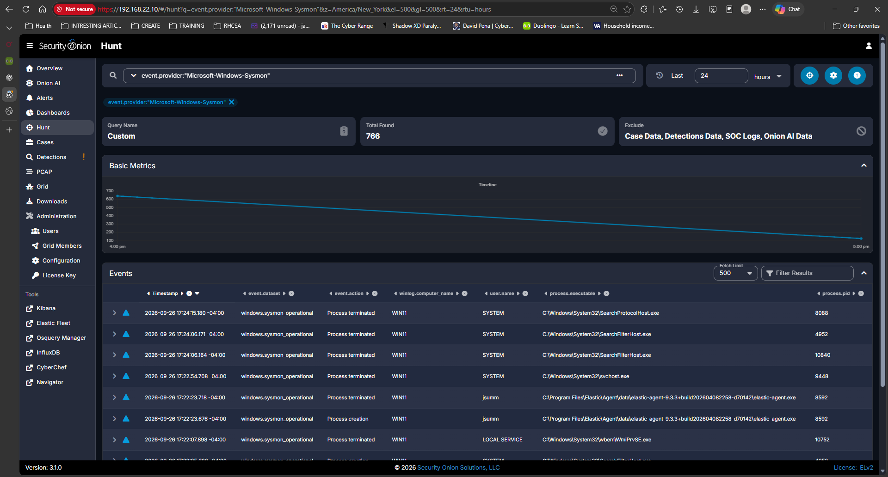

# Investigation 03 – Suspicious PowerShell Execution Policy Bypass

## Overview

This project demonstrates the creation, validation, deployment, and investigation of a custom Sigma detection rule in Security Onion. The goal was to detect PowerShell execution using the `-ExecutionPolicy Bypass` option, generate a corresponding SOC alert, and investigate the activity using Sysmon and Elastic Endpoint telemetry.

The investigation followed a realistic SOC workflow: endpoint telemetry was collected from a Windows 11 system, a Sigma detection rule was written and validated, an alert was generated, and the resulting activity was investigated by reviewing process execution, command-line arguments, file activity, parent-child relationships, and network behavior.

The final disposition was **Benign Positive – Authorized Test Activity** because the rule correctly identified suspicious PowerShell behavior, but the activity was intentionally generated inside the home lab.

---

## Skills Demonstrated

- Security Onion
- Sysmon
- Elastic Agent
- Elastic Endpoint
- Sigma rule development
- Detection engineering
- EQL validation
- Alert triage
- Threat hunting
- Process-tree analysis
- Endpoint telemetry analysis
- Parent-child process investigation
- Network activity validation
- Firewall troubleshooting
- MITRE ATT&CK mapping
- Incident disposition
- SIEM troubleshooting

---

## Lab Environment

- Security Onion 3.1
- Windows 11 endpoint
- Sysmon
- Elastic Agent
- Elastic Endpoint
- pfSense
- VMware Workstation

### Network Information

| System | IP Address |
|---|---|
| Windows 11 Endpoint | `192.168.40.101` |
| Security Onion | `192.168.22.10` |
| Windows Default Gateway / pfSense | `192.168.40.254` |

---

## Investigation Objective

The objective of this project was to:

1. Verify Windows Sysmon telemetry was reaching Security Onion.
2. Generate controlled PowerShell activity.
3. Create a custom Sigma detection rule.
4. Validate the Sigma rule against real endpoint telemetry.
5. Generate an alert from the custom rule.
6. Triage the alert.
7. Pivot from the alert into Security Onion Hunt.
8. Investigate related process and file activity.
9. Reconstruct the parent-child process tree.
10. Determine whether the activity was malicious or benign.

---

# Phase 1 – Validate Endpoint Telemetry

Sysmon was installed and enabled on the Windows 11 endpoint.

The following PowerShell command was used to confirm that Sysmon was generating events locally:

```powershell
Get-WinEvent -LogName "Microsoft-Windows-Sysmon/Operational" -MaxEvents 5 |
Select-Object TimeCreated, Id, ProviderName
```

Security Onion Hunt was then used to verify that Sysmon events were successfully reaching the SIEM.

The query used was:

```text
event.provider:"Microsoft-Windows-Sysmon"
```

The search returned hundreds of Windows Sysmon events from the `WIN11` endpoint, confirming that endpoint telemetry was successfully being ingested.



---

# Phase 2 – Troubleshoot Elastic Agent Connectivity

During setup, the Windows Elastic Agent initially could not communicate with Security Onion Fleet Server.

Elastic Agent reported an error similar to:

```text
fail to checkin to fleet-server
https://192.168.22.10:8220
```

The Windows endpoint was located on:

```text
192.168.40.101
```

while Security Onion was located on:

```text
192.168.22.10
```

The first troubleshooting step was to verify basic network connectivity.

```powershell
ping 192.168.40.254
ping 192.168.22.10
tracert 192.168.22.10
```

The results showed that:

- Windows could reach its pfSense gateway.
- Windows could reach Security Onion.
- Routing between the two subnets was functioning correctly.

The Fleet Server port was then tested:

```powershell
Test-NetConnection 192.168.22.10 -Port 8220
```

Initially:

```text
TcpTestSucceeded : False
```

On Security Onion, TCP port `8220` was confirmed to be listening:

```bash
sudo ss -lntp | grep 8220
```

The result showed that Security Onion was listening on:

```text
0.0.0.0:8220
```

This ruled out a stopped Fleet Server and narrowed the problem to access control.

### Root Cause

Security Onion's `elastic_agent_endpoint` firewall hostgroup allowed:

```text
192.168.22.0/24
```

but the Windows endpoint existed on:

```text
192.168.40.0/24
```

The Windows subnet was added to:

```text
Administration
→ Configuration
→ Firewall
→ Hostgroups
→ elastic_agent_endpoint
```

The allowed networks became:

```text
192.168.22.0/24
192.168.40.0/24
```

After synchronizing the Security Onion firewall, the connectivity test was repeated:

```powershell
Test-NetConnection 192.168.22.10 -Port 8220
```

The result changed to:

```text
TcpTestSucceeded : True
```

The Elastic Agent was restarted:

```powershell
Restart-Service "Elastic Agent"
```

After the connectivity issue was resolved, Sysmon telemetry began flowing successfully into Security Onion.

---

# Phase 3 – Generate Controlled PowerShell Activity

A safe PowerShell command was used to generate activity that would be suspicious enough to detect without causing damage:

```powershell
powershell.exe -NoProfile -ExecutionPolicy Bypass -Command "Get-Process | Select-Object -First 5"
```

The command simply displays several running processes.

The important behavior was:

```text
-ExecutionPolicy Bypass
```

This option can be used legitimately by administrators, but attackers may also use it to bypass PowerShell execution policy restrictions.

The activity was visible in Security Onion as a PowerShell process creation event.

---

# Phase 4 – Create a Custom Sigma Detection

A custom Sigma rule was created in Security Onion to detect PowerShell execution using potentially suspicious execution-policy options.

## Sigma Rule

```yaml
title: Suspicious PowerShell Execution Policy Bypass
id: 8c5d9e9f-5c2e-4d98-b5d1-4c8c2d2d1001
status: experimental
description: Detects PowerShell execution using the ExecutionPolicy Bypass option, which may be used to circumvent PowerShell execution restrictions.
author: jsumm
date: 2026-09-26

tags:
  - attack.execution
  - attack.t1059.001

logsource:
  category: process_creation
  product: windows

detection:
  selection_image:
    Image|endswith:
      - '\powershell.exe'
      - '\pwsh.exe'

  selection_commandline:
    CommandLine|contains:
      - '-ExecutionPolicy Bypass'
      - '-ExecutionPolicy Unrestricted'
      - '-ep Bypass'

  condition: selection_image and selection_commandline

falsepositives:
  - Administrative scripts
  - Software installation
  - Legitimate IT automation

level: medium
```

The detection was created with:

```text
Type: Sigma
Severity: Medium
Ruleset: Custom
Enabled: True
```

---

# Phase 5 – Validate the Sigma Rule

Before relying on the rule, the Sigma detection was converted to EQL inside Security Onion.

The conversion mapped the generic Sigma fields to Elastic fields such as:

```text
process.executable
process.command_line
```

The converted EQL query was tested in Kibana Dev Tools.

The validation successfully matched the previously generated PowerShell process and showed arguments including:

```text
-NoProfile
-ExecutionPolicy
Bypass
-Command
Get-Process | Select-Object -First 5
```

This confirmed that the detection logic matched the actual endpoint telemetry before the rule was fully deployed.

---

# Phase 6 – Generate the Alert

After the Sigma rule was created and enabled, the test PowerShell command was executed again.

Security Onion generated the custom alert:

```text
Suspicious PowerShell Execution Policy Bypass
```

The alert showed:

```text
Event Module: sigma
Severity: medium
```


This confirmed the complete detection pipeline:

```text
PowerShell Activity
        ↓
Sysmon
        ↓
Elastic Agent
        ↓
Security Onion
        ↓
Custom Sigma Rule
        ↓
ElastAlert
        ↓
SOC Alert
```

---

# Phase 7 – Alert Triage

The alert was expanded to identify the affected endpoint.

The host was:

```text
WIN11
```

with IP address:

```text
192.168.40.101
```


The user associated with the event was:

```text
jsumm
```

The telemetry originated from:

```text
Microsoft-Windows-Sysmon/Operational
```

The suspicious process was:

```text
powershell.exe
```


The executable path was:

```text
C:\Windows\System32\WindowsPowerShell\v1.0\powershell.exe
```

The full command line was:

```text
"C:\WINDOWS\System32\WindowsPowerShell\v1.0\powershell.exe" -NoProfile -ExecutionPolicy Bypass -Command "Get-Process | Select-Object -First 5"
```


The important suspicious indicator was:

```text
-ExecutionPolicy Bypass
```

At this point, the activity was treated as **suspicious and requiring investigation** rather than immediately being classified as malicious.

---

# Phase 8 – Identify the Process ID

The PowerShell process that generated the alert had:

```text
PID: 8552
Parent PID: 10692
```


The Sysmon event code was:

```text
Event ID 1
```

which represents a **Process Creation** event.


---

# Phase 9 – Pivot from Alert to Hunt

The alert process was investigated further using Security Onion Hunt.

The query used was:

```text
process.pid:8552 OR process.parent.pid:8552
```

This returned 24 related events.


The related telemetry included:

- Process creation
- Process termination
- Library loading
- File activity

This provided context around what the PowerShell process did before terminating.

---

# Phase 10 – Investigate File Activity

One related endpoint event showed PowerShell modifying:

```text
C:\Users\jsumm\AppData\Local\Microsoft\Windows\PowerShell\StartupProfileData-NonInteractive
```


The filename was:

```text
StartupProfileData-NonInteractive
```

This file activity was consistent with normal PowerShell execution and did not by itself indicate malware or persistence.

---

# Phase 11 – Check for Network Activity

A search was performed for network activity associated with PID `8552`.

The investigation did not identify related network events for the suspicious PowerShell process.

This reduced the likelihood that the process was:

- Downloading a payload
- Connecting to command-and-control infrastructure
- Exfiltrating data
- Communicating with an external system

No suspicious network activity was identified during the investigation.

---

# Phase 12 – Investigate the Parent PowerShell Process

The parent PID of the suspicious PowerShell process was:

```text
10692
```

A Hunt search was performed:

```text
process.pid:10692
```

PID `10692` was also:

```text
powershell.exe
```

and was executing from the expected Microsoft path:

```text
C:\Windows\System32\WindowsPowerShell\v1.0\powershell.exe
```

The binary was shown as Microsoft-signed and trusted.

Its parent PID was:

```text
2524
```


This showed that the suspicious PowerShell process was launched from an already running PowerShell session.

---

# Phase 13 – Trace the Process Chain to Explorer

The investigation continued by searching for:

```text
process.pid:2524
```

Security Onion identified PID `2524` as:

```text
explorer.exe
```


The executable path was:

```text
C:\Windows\explorer.exe
```

The parent executable was:

```text
C:\Windows\System32\userinit.exe
```


This established a normal interactive Windows process chain.

---

# Process Tree Reconstruction

The complete process chain was reconstructed as:

```text
userinit.exe
    ↓
explorer.exe
PID 2524
    ↓
powershell.exe
PID 10692
    ↓
powershell.exe
PID 8552
    ↓
-NoProfile
-ExecutionPolicy Bypass
-Command "Get-Process | Select-Object -First 5"
```

This process tree was consistent with an interactive user launching PowerShell and then manually starting a second PowerShell process.

---

# Analysis

Several factors were considered during the investigation.

### Suspicious Indicators

- PowerShell execution
- `-ExecutionPolicy Bypass`
- Child PowerShell process
- Custom Sigma rule triggered

### Benign Indicators

- PowerShell executed from the legitimate Microsoft path
- Microsoft-signed executable
- Trusted code signature
- Known interactive user
- Parent process chain traced back to `explorer.exe`
- `explorer.exe` traced back to `userinit.exe`
- No suspicious network activity identified
- No suspicious child processes identified
- File activity appeared consistent with normal PowerShell behavior
- Activity was generated intentionally during an authorized lab test

---

# MITRE ATT&CK Mapping

The behavior maps to:

## T1059.001 – PowerShell

**Tactic:** Execution

**Technique:** Command and Scripting Interpreter: PowerShell

PowerShell is a legitimate Windows administration tool, but attackers may abuse it to execute commands, scripts, payloads, and post-exploitation activity.

The existence of PowerShell activity alone is therefore not sufficient to determine malicious intent. Context such as command-line arguments, parent processes, network behavior, file activity, user identity, and surrounding telemetry must be evaluated.

---

# Final Disposition

## Benign Positive – Authorized Test Activity

The detection rule operated correctly.

The PowerShell process genuinely used:

```text
-ExecutionPolicy Bypass
```

Therefore, the alert was not considered a false positive.

However, the investigation determined that the activity was authorized and benign because:

- The command was intentionally generated in the home lab.
- The PowerShell executable was legitimate and Microsoft-signed.
- The executable ran from the expected Windows path.
- The user was known.
- No suspicious network connections were identified.
- No suspicious child processes were identified.
- The parent process chain was consistent with an interactive Windows session.
- File activity was consistent with expected PowerShell behavior.

The proper disposition was therefore:

```text
Benign Positive – Authorized Test Activity
```

---

# Investigation Timeline

| Stage | Finding |
|---|---|
| Telemetry Validation | Sysmon events successfully reached Security Onion |
| Connectivity Issue | Elastic Agent could not initially reach Fleet Server |
| Root Cause | Windows subnet was missing from Security Onion endpoint firewall hostgroup |
| Remediation | Added `192.168.40.0/24` and synchronized firewall |
| Test Activity | PowerShell executed with `-ExecutionPolicy Bypass` |
| Detection | Custom Sigma rule created |
| Validation | Sigma rule successfully matched telemetry in Kibana |
| Alert | Custom PowerShell alert generated |
| Initial Triage | Host, user, process, command line, and PID identified |
| Hunt Pivot | PID `8552` used to investigate surrounding activity |
| File Analysis | PowerShell startup-profile-related file activity identified |
| Network Analysis | No related suspicious network activity identified |
| Parent Process | PID `10692` identified as PowerShell |
| Parent Pivot | PID `2524` identified as Explorer |
| Process Reconstruction | `userinit.exe → explorer.exe → powershell.exe → powershell.exe` |
| Disposition | Benign Positive – Authorized Test Activity |

---

# Detection Engineering Lifecycle

This project demonstrates the complete detection engineering lifecycle:

```text
Telemetry Collection
        ↓
Detection Development
        ↓
Sigma Rule Creation
        ↓
Rule Conversion
        ↓
EQL Validation
        ↓
Deployment
        ↓
Alert Generation
        ↓
SOC Triage
        ↓
Threat Hunting
        ↓
Process Reconstruction
        ↓
MITRE ATT&CK Mapping
        ↓
Final Disposition
```

---

# Key Lessons Learned

### 1. An alert is the beginning of the investigation

The detection identified suspicious behavior, but the alert alone could not determine whether the activity was malicious.

### 2. Command-line telemetry is extremely valuable

The full command line revealed the exact behavior that triggered the rule:

```text
-ExecutionPolicy Bypass
```

### 3. Parent-child process relationships provide critical context

Tracing:

```text
powershell.exe
→ powershell.exe
→ explorer.exe
→ userinit.exe
```

helped determine that the activity originated from an interactive user session.

### 4. Network activity can change the severity of an investigation

The absence of related network activity made malicious download, command-and-control, and exfiltration activity less likely.

### 5. Detection does not automatically mean compromise

Legitimate administrative activity may resemble attacker behavior. SOC analysts must validate context before escalating an incident.

### 6. Troubleshooting the telemetry pipeline is part of SOC work

Before the investigation could begin, endpoint-to-SIEM connectivity had to be diagnosed and repaired. The issue was isolated by testing:

```text
Endpoint
→ Gateway
→ Security Onion
→ TCP 8220
→ Fleet Server
→ Security Onion Firewall
```

---

# Why This Project Matters

This project goes beyond simply generating an alert.

It demonstrates the ability to:

- Configure endpoint telemetry
- Troubleshoot SIEM ingestion problems
- Create custom detections
- Validate detection logic
- Generate controlled security events
- Triage alerts
- Investigate endpoint activity
- Pivot using process identifiers
- Reconstruct process ancestry
- Review file and network behavior
- Map findings to MITRE ATT&CK
- Make a defensible incident disposition

These are core skills used by SOC analysts and detection engineers in enterprise environments.

---

# Project Evidence

Additional screenshots are available in the `screenshots/` directory.

The complete evidence set documents:

- Sysmon telemetry ingestion
- Alert metadata
- Host information
- User information
- Process details
- Process executable
- PowerShell command line
- Parent process information
- Process IDs
- Sysmon Event ID
- Hunt pivots
- File activity
- Process entity information
- Parent PowerShell investigation
- Explorer process investigation
- Process-chain reconstruction

---

# Repository Structure

```text
03-powershell-execution-policy-bypass/
│
├── README.md
│
├── detection/
│   └── suspicious-powershell-execution-policy-bypass.yml
│
└── screenshots/
    ├── 01-sysmon-telemetry-confirmed.png
    ├── 02-alert-details-overview.png
    ├── 03-alert-host-details.png
    ├── 04-alert-user-details.png
    ├── 05-alert-process-name.png
    ├── 06-alert-process-executable.png
    ├── 07-alert-command-line.png
    ├── 08-alert-parent-process.png
    ├── 09-alert-process-id.png
    ├── 10-alert-timestamp.png
    ├── 11-alert-sysmon-event-id-1.png
    ├── 12-process-pivot-pid-8552.png
    ├── 13-powershell-file-path.png
    ├── 14-powershell-file-name.png
    ├── 15-powershell-process-entity-id.png
    ├── 16-powershell-parent-pid.png
    ├── 17-powershell-file-event-overview.png
    ├── 18-parent-powershell-pid-10692.png
    ├── 19-parent-powershell-user-details.png
    ├── 20-parent-powershell-file-rename-event.png
    ├── 21-parent-powershell-file-activity.png
    ├── 22-explorer-parent-pivot-pid-2524.png
    └── 23-explorer-process-details.png
```

---

# Conclusion

This investigation demonstrated an end-to-end SOC detection and investigation workflow using Security Onion, Sysmon, Elastic Agent, Elastic Endpoint, Sigma, and Kibana.

A custom Sigma rule was developed to detect PowerShell execution using `-ExecutionPolicy Bypass`. The rule was validated against real Sysmon telemetry, deployed into Security Onion, and successfully generated alerts.

The alert was then investigated by reviewing the affected host, user, command line, process ID, parent processes, file activity, and network behavior. The investigation reconstructed the process chain from the suspicious PowerShell instance back through another PowerShell process, Windows Explorer, and `userinit.exe`.

Although the activity matched a behavior that can be associated with attacker tradecraft, the available evidence showed that the event was legitimate and intentionally generated as part of the lab.

The final disposition was:

**Benign Positive – Authorized Test Activity**

This project demonstrates practical experience with detection engineering, SOC triage, endpoint investigation, telemetry troubleshooting, process analysis, MITRE ATT&CK mapping, and evidence-based incident classification.