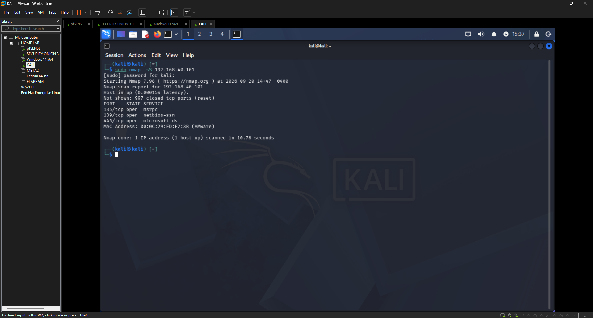
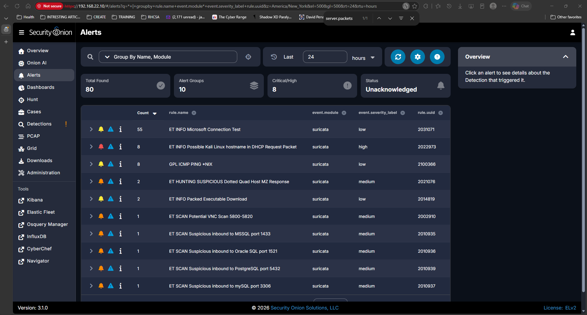
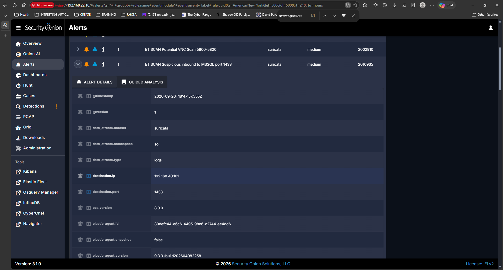
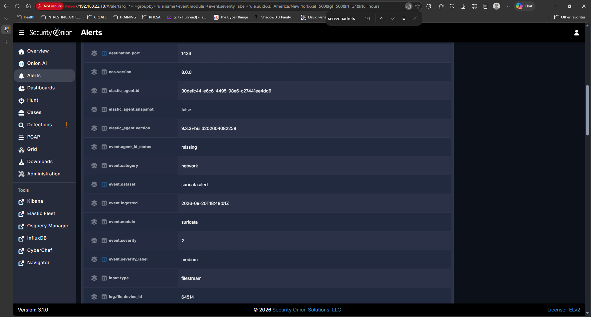
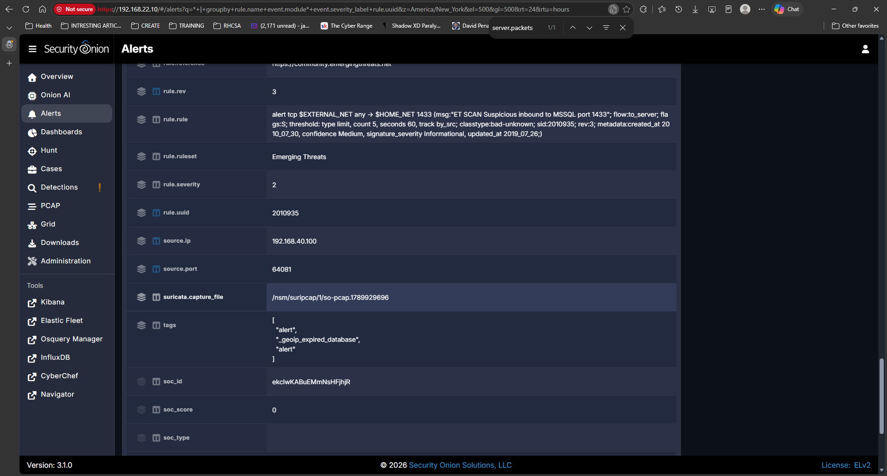
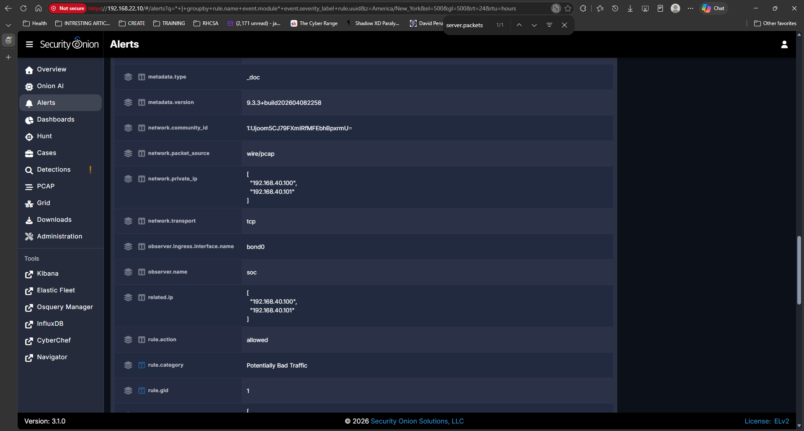
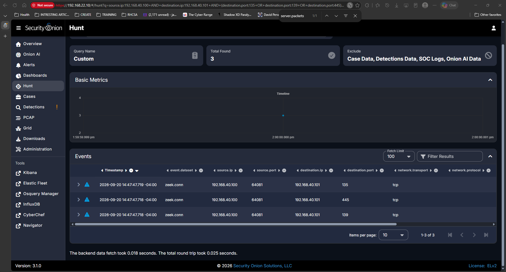
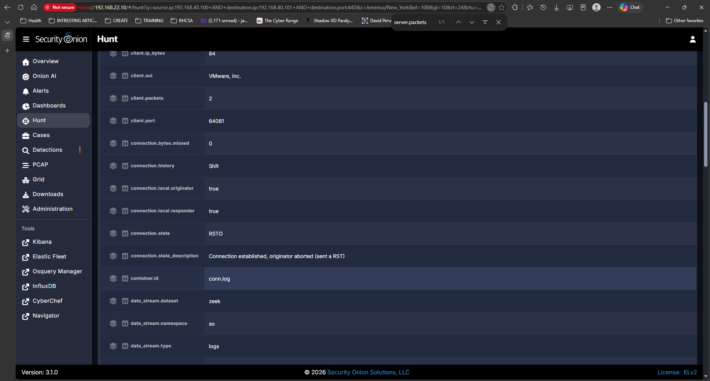

# Investigation 01: Nmap SYN Scan Detection

## Executive Summary

This investigation demonstrates the detection and analysis of network reconnaissance within a controlled cybersecurity home lab. A Kali Linux system at `192.168.40.100` performed an authorized Nmap TCP SYN scan against a Windows 11 system at `192.168.40.101`. The scan identified TCP ports 135, 139, and 445 as open on the Windows host.

Security Onion monitored the network traffic through its passive monitoring interface. Suricata generated multiple scan-related alerts, while Zeek recorded connection telemetry that was used to investigate and correlate the activity.

Analysis of the collected evidence determined that the activity was authorized reconnaissance performed as part of the lab exercise. No evidence collected during this investigation indicated that the Windows system was compromised.

**Final Disposition:** Expected Activity — Authorized Reconnaissance

## Lab Environment

| System | IP Address | Role |
|---|---|---|
| Kali Linux | `192.168.40.100` | Authorized security testing system |
| Windows 11 | `192.168.40.101` | Monitored endpoint |
| pfSense OPT1 | `192.168.40.254` | Gateway, firewall, and DHCP |
| Security Onion | `192.168.22.10` | Security monitoring and investigation platform |
| Security Onion ens192 | No IP | Passive monitoring interface on VMnet2 |

The reconnaissance activity occurred on the `192.168.40.0/24` monitored network. Kali Linux generated the test activity against the Windows 11 endpoint while Security Onion passively monitored the network traffic using Zeek and Suricata.

## Reconnaissance

To generate controlled reconnaissance activity, Kali Linux (`192.168.40.100`) performed a TCP SYN scan against the Windows 11 endpoint (`192.168.40.101`) using Nmap.

### Nmap Command

```bash
sudo nmap -sS 192.168.40.101
```

The `-sS` option performs a TCP SYN scan. Nmap identified TCP ports 135 (`msrpc`), 139 (`netbios-ssn`), and 445 (`microsoft-ds`) as open on the Windows 11 endpoint.

### Nmap Scan Evidence



**Figure 1 — Nmap SYN Scan Results:** TCP ports 135, 139, and 445 were identified as open on the Windows 11 endpoint.

## Security Onion Detection

After the Nmap SYN scan was executed, Security Onion detected the reconnaissance activity through Suricata. Multiple medium-severity scan-related alerts were generated, including probes associated with VNC, MSSQL, Oracle SQL, PostgreSQL, and MySQL ports.

These alerts demonstrated that Security Onion could detect suspicious network reconnaissance originating from the Kali Linux testing system. The alerts represented detection events that required further investigation and did not, by themselves, indicate that the targeted services were running or that the Windows endpoint had been compromised.

### Security Onion Alert Evidence



**Figure 2 — Security Onion Scan Alerts:** Suricata generated multiple medium-severity scan-related alerts following the authorized Nmap SYN scan.

## Alert Triage

To investigate the detected reconnaissance activity, the Suricata alert `ET SCAN Suspicious inbound to MSSQL port 1433` was selected for further analysis.

The alert details identified the following network activity:

- **Source IP:** `192.168.40.100` — Kali Linux
- **Destination IP:** `192.168.40.101` — Windows 11
- **Destination Port:** `1433`
- **Protocol:** TCP
- **Severity:** Medium
- **Event Dataset:** `suricata.alert`
- **Ruleset:** Emerging Threats
- **Rule Category:** Potentially Bad Traffic
- **Rule Action:** Allowed

The source and destination addresses established that the traffic originated from the Kali Linux testing system and was directed toward the Windows 11 endpoint. Port 1433 is associated with Microsoft SQL Server; however, the alert only indicates that traffic matching the Suricata detection rule was observed. It does not establish that an MSSQL service was running on the Windows system.

### MSSQL Alert Evidence









**Figure 3 — MSSQL Alert Triage:** Suricata alert evidence identified Kali Linux (`192.168.40.100`) as the source of TCP reconnaissance directed toward the Windows 11 endpoint (`192.168.40.101`) on destination port 1433.

## Zeek Telemetry Correlation

After reviewing the Suricata alert, Security Onion Hunt was used to examine Zeek connection telemetry between the Kali Linux system (`192.168.40.100`) and the Windows 11 endpoint (`192.168.40.101`).

The investigation focused on TCP ports 135, 139, and 445 because these were the three ports identified as open by the original Nmap scan.

### Hunt Query

```text
source.ip:192.168.40.100 AND destination.ip:192.168.40.101 AND (destination.port:135 OR destination.port:139 OR destination.port:445)
```

Zeek `conn` telemetry showed connections from Kali Linux to the Windows 11 endpoint on all three destination ports. This provided an additional network data source that could be correlated with the Nmap scan results.

### Zeek Correlation Evidence



**Figure 4 — Zeek Open-Port Correlation:** Zeek recorded connections from Kali Linux (`192.168.40.100`) to Windows 11 (`192.168.40.101`) on TCP ports 135, 139, and 445.

## TCP/445 Connection Analysis

The Zeek connection record for TCP port 445 was examined in greater detail. TCP/445 is commonly associated with Microsoft SMB services. The connection originated from Kali Linux (`192.168.40.100`) and targeted the Windows 11 endpoint (`192.168.40.101`).

Zeek recorded a small TCP exchange consisting of two client packets and one server packet. The connection was recorded with a state of `RSTO`, which Zeek described as **"Connection established, originator aborted (sent a RST)."**

When correlated with the authorized Nmap SYN scan, the short connection and reset behavior were consistent with the reconnaissance activity observed during the exercise. Nmap independently reported TCP/445 as open on the Windows endpoint. The Zeek record provides additional evidence of the interaction between the Kali testing system and TCP/445 but does not, by itself, indicate exploitation or compromise.

### TCP/445 Connection Evidence




**Figure 5 — TCP/445 Connection Analysis:** Zeek recorded the Kali-to-Windows TCP/445 connection and classified the connection state as `RSTO`, indicating that the originator reset the connection.


## Final Analysis and Disposition

Analysis of the collected evidence determined that the observed reconnaissance activity originated from Kali Linux (`192.168.40.100`) and targeted the Windows 11 endpoint (`192.168.40.101`).

Nmap identified TCP ports 135, 139, and 445 as open on the Windows endpoint. Security Onion observed the network activity, Suricata generated multiple scan-related alerts, and Zeek recorded connection telemetry associated with the reconnaissance. Correlation of the source and destination addresses, destination ports, IDS alerts, and Zeek telemetry was consistent with the authorized Nmap SYN scan performed during the lab exercise.

No evidence collected during this investigation demonstrated exploitation, unauthorized access, malware execution, or compromise of the Windows 11 endpoint. The Suricata alerts represented detections of reconnaissance behavior rather than confirmation of a successful attack.

Because the activity was intentionally generated as part of an authorized security exercise, the incident was classified as:

**Final Disposition: Expected Activity — Authorized Reconnaissance**

### Investigation Summary

| Field | Determination |
|---|---|
| Source | Kali Linux — `192.168.40.100` |
| Target | Windows 11 — `192.168.40.101` |
| Activity | TCP SYN reconnaissance |
| Reconnaissance Tool | Nmap |
| IDS Detection | Suricata |
| Network Telemetry | Zeek |
| Open Ports Identified | TCP/135, TCP/139, TCP/445 |
| Alert Severity | Medium scan-related detections |
| Evidence of Exploitation | None identified |
| Evidence of Compromise | None identified |
| Final Disposition | **Expected Activity — Authorized Reconnaissance** |

## Skills Demonstrated

This investigation demonstrated practical SOC analyst skills across network monitoring, alert triage, telemetry analysis, and incident documentation.

- Network reconnaissance using Nmap TCP SYN scanning
- Security Onion alert investigation
- Suricata IDS alert triage
- Zeek network telemetry analysis
- Source and destination IP correlation
- TCP port and service analysis
- TCP connection-state interpretation
- Correlation of multiple security data sources
- Differentiation between detection, exploitation, and compromise
- False-positive and expected-activity analysis
- Evidence collection and documentation
- Final incident disposition and reporting